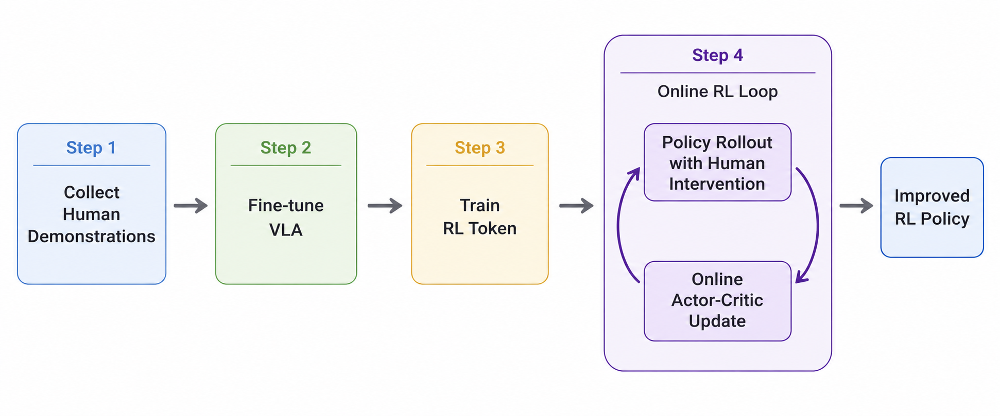

<h1 align="center">Evo-RLT</h1>

<p align="center">
  <a href="https://github.com/huggingface/lerobot"></a>
  <a href="https://huggingface.co/datasets/Elvinky/bi-so101-insert-screw-562ep"></a>
  <a href="https://huggingface.co/datasets/MINT-SJTU/RW-RL-Dataset"></a>
  <a href="https://huggingface.co/Shiki42/pi05_screw_c_mix_cont15k_fp16/tree/main"></a>
  <a href="https://huggingface.co/Shiki42/pi05_screw_c_mix_cont15k_fp16/tree/main"></a>
  <a href="./LICENSE"></a>
</p>

<p align="center"><strong>SJTU-MINT</strong></p>

<p align="center">
  <strong>A LeRobot-based reproduction of <a href="https://www.pi.website/research/rlt">RLT</a>, covering RL-token learning, transition-cache generation, actor-critic training, and real-robot rollout.</strong>
</p>

<p align="center"><strong>RLT Pipeline</strong></p>

<p align="center">
  
</p>

<p align="center"><strong>Real-Robot Rollout Demo</strong></p>

<p align="center">
  
</p>

<p align="center"><strong>Collect Human Demonstrations</strong></p>

<p align="center">
  
</p>

<p align="center"><strong>Policy Rollout with Human Intervention</strong></p>

<p align="center">
  
</p>

## 🎯 Evo-RLT Focus

- **RLT reproduction:** this repository presents RLT as an independent LeRobot-based reproduction for the pi paper.
- **Open training path:** the code covers VLA finetuning, RL-token learning, transition-cache generation, and chunk actor-critic training.
- **Real-robot deployment path:** the recording wrapper supports VLA/RLT rollout, RTC defaults, pedal labels, and human-in-the-loop collection.

## 📰 News

- **[2026-06-29]** Released Evo-RLT.
- **[2026-06-26]** Added training dataset and checkpoint links.

## 🧭 Table of Contents

| Getting Started | Training Pipeline | Project Info |
| -------------------------------------- | -------------------------------------------- | ------------------------------------------- |
| [⚡ Quick Start](#quick-start) | [🧪 Training Pipeline](#training-pipeline) | [🤗 Model & Dataset](#model-dataset) |
| [1) Installation](#installation) | [3) Finetune VLA](#finetune-vla) | [🗂️ Repository Layout](#repository-layout) |
| [2) Hardware Setup](#hardware-setup) | [4) Train RL Token](#train-rl-token) | [✅ Development Checks](#development-checks) |
| [🤖 Real-Robot Recording and Deployment](#real-robot-recording-and-deployment) | [5) Build Transition Cache](#build-transition-cache) | [🧭 Future TODO](#future-todo) |
| | [6) Train Chunk Actor-Critic](#train-chunk-actor-critic) | [💬 Community Channels](#community-channels) / [🏫 Affiliations](#affiliations) / [📄 License](#license) |

<a id="quick-start"></a>

## ⚡ Quick Start

<a id="installation"></a>

### 1) Installation

Evo-RLT depends on LeRobot `v0.5.1`, which currently ships from the official GitHub tag and requires Python 3.12+. The `lerobot` extra installs both pi0.5 and SmolVLA policy dependencies.

```bash
git clone https://github.com/MINT-SJTU/Evo-RLT.git
cd evo-rlt

conda create -y -n evo-rlt python=3.12
conda activate evo-rlt

python -m pip install -e ".[lerobot]"
```

Do not put a local LeRobot source checkout on `PYTHONPATH`; Evo-RLT is tested against the official LeRobot package installed by the `lerobot` extra.

Evo-RLT keeps policy registration out of LeRobot source files. Before using LeRobot factory helpers with RLT policy types, register the adapter once:

```python
from evo_rlt.adapters.lerobot import register

register()
```

Registered policy types:

```text
rlt_token    # RL-token reconstruction policy
rlt_ac       # chunk actor-critic policy
rlt          # deployment policy wrapper
```

### LeRobot 0.5.1 Normalization

Evo-RLT follows the LeRobot `>=0.5` processor-pipeline runtime:

```text
raw observation -> policy_preprocessor -> policy -> policy_postprocessor -> robot action
```

Checkpoints trained or migrated for LeRobot `>=0.5` are expected to include `policy_preprocessor.json`, `policy_postprocessor.json`, and processor weight files such as `NormalizerProcessorStep` / `UnnormalizerProcessorStep` statistics. The presence of `NormalizerProcessorStep` is normal in LeRobot `0.5.1`; it is not a legacy workaround.

Only migrate normalization for checkpoints trained before LeRobot's processor-pipeline migration. For those checkpoints, verify normalization is not applied twice: model weights should not contain embedded normalization keys such as `normalize_inputs.*`, and the external pre/postprocessor stats must match the training normalization modes.

<a id="hardware-setup"></a>

### 2) Hardware Setup

Use the [Evo-RL hardware setup](https://github.com/MINT-SJTU/Evo-RL#2-hardware-setup) for the shared SO-series robot bring-up steps: assembly, stable serial/camera paths, camera validation, and basic teleoperation checks. PiPER/PiPER-X support is planned; see [Future TODO](#future-todo).

This repository only differs at the recording/deployment configuration layer:

- `evo-rlt-record` reads a setup manifest from `--setup-json`, or from `~/.roboclaw/workspace/embodied/manifest.json` when the flag is omitted.
- Arm entries point to per-device `calibration_dir` folders. The wrapper looks for `<calibration_dir>/<folder-name>.json`, then stages those files into temporary LeRobot-compatible names at runtime.
- A manifest may describe either one SO follower arm or a dual-arm SO setup.
  Single-arm manifests use LeRobot `so101_follower` / `so101_leader` by default;
  add `"model": "so100"` to an arm entry if you need SO100 CLI types.
- Single-arm follower and leader calibrations are staged as `so101_follower.json`
  and `so101_leader.json` by default.
- Dual-arm follower calibrations are staged as `bimanual_left.json` and
  `bimanual_right.json` under a temporary robot calibration directory.
- Dual-arm leader calibrations are staged as `bimanual_leader_left.json` and
  `bimanual_leader_right.json` under a temporary teleop calibration directory.
- Dataset paths are created under `<datasets.root>/<MMDD>_<dataset-tag>/<prefix>_<HHMMSS>`. If `datasets.root` is omitted, the default is `~/.roboclaw/workspace/embodied/datasets`.

Example single-arm setup manifest:

```json
{
  "datasets": {"root": "/path/to/lerobot_datasets"},
  "arms": [
    {
      "alias": "solo_follower",
      "type": "follower",
      "port": "/dev/serial/by-id/<follower>",
      "calibration_dir": "/path/to/calibration/<follower-serial>"
    },
    {
      "alias": "solo_leader",
      "type": "leader",
      "port": "/dev/serial/by-id/<leader>",
      "calibration_dir": "/path/to/calibration/<leader-serial>"
    }
  ],
  "cameras": [
    {
      "alias": "wrist",
      "port": "/dev/v4l/by-path/<wrist-camera>",
      "width": 640,
      "height": 480,
      "fps": 30,
      "fourcc": "MJPG"
    },
    {
      "alias": "front",
      "port": "/dev/v4l/by-path/<front-camera>",
      "width": 640,
      "height": 480,
      "fps": 30,
      "fourcc": "MJPG"
    }
  ]
}
```

If you only need policy rollout without leader-arm teleoperation, omit the leader
entry and pass `--no-teleop` to compatible modes. Default `collect` requires a
leader arm because it is built for human intervention.

Example dual-arm setup manifest:

```json
{
  "datasets": {"root": "/path/to/lerobot_datasets"},
  "arms": [
    {
      "alias": "left_follower",
      "type": "follower",
      "port": "/dev/serial/by-id/<left-follower>",
      "calibration_dir": "/path/to/calibration/<left-follower-serial>"
    },
    {
      "alias": "right_follower",
      "type": "follower",
      "port": "/dev/serial/by-id/<right-follower>",
      "calibration_dir": "/path/to/calibration/<right-follower-serial>"
    },
    {
      "alias": "left_leader",
      "type": "leader",
      "port": "/dev/serial/by-id/<left-leader>",
      "calibration_dir": "/path/to/calibration/<left-leader-serial>"
    },
    {
      "alias": "right_leader",
      "type": "leader",
      "port": "/dev/serial/by-id/<right-leader>",
      "calibration_dir": "/path/to/calibration/<right-leader-serial>"
    }
  ],
  "cameras": [
    {
      "alias": "left_wrist",
      "port": "/dev/v4l/by-path/<left-wrist>",
      "width": 640,
      "height": 480,
      "fps": 30,
      "fourcc": "MJPG"
    },
    {
      "alias": "right_wrist",
      "port": "/dev/v4l/by-path/<right-wrist>",
      "width": 640,
      "height": 480,
      "fps": 30,
      "fourcc": "MJPG"
    },
    {
      "alias": "right_front",
      "port": "/dev/v4l/by-path/<right-front>",
      "width": 640,
      "height": 480,
      "fps": 30,
      "fourcc": "MJPG"
    }
  ]
}
```

<a id="training-pipeline"></a>

## 🧪 Training Pipeline

The typical RLT workflow has four stages. Video datasets require FFmpeg shared libraries for LeRobot `0.5.1` / TorchCodec decoding:

```bash
sudo apt-get update && sudo apt-get install -y ffmpeg
```

For saved checkpoints, LeRobot `0.5.1` writes numeric checkpoint directories such as `checkpoints/000001/pretrained_model`. Use the latest numeric directory when `checkpoints/last/pretrained_model` is not present.

<a id="finetune-vla"></a>

### 3) Finetune VLA

Use LeRobot's training entrypoint to finetune a VLA checkpoint on a LeRobot dataset. For pi0.5, use a pi0.5 base checkpoint; for SmolVLA, use a SmolVLA base checkpoint such as `lerobot/smolvla_base`.

```bash
python -m lerobot.scripts.lerobot_train \
  --dataset.repo_id=<HF_ORG>/<DATASET> \
  --dataset.root=<LOCAL_DATASET_ROOT> \
  --policy.path=<BASE_PI05_CHECKPOINT_DIR> \
  --policy.device=cuda \
  --policy.dtype=bfloat16 \
  --batch_size=16 \
  --steps=30000 \
  --save_freq=5000 \
  --eval_freq=0 \
  --tolerance_s=0.04 \
  --output_dir=outputs/vla_ft \
  --job_name=vla_ft
```

For SmolVLA, replace `--policy.path=<BASE_PI05_CHECKPOINT_DIR>` with `--policy.path=<BASE_SMOLVLA_CHECKPOINT_DIR>` and remove `--policy.dtype=...` if your SmolVLA config does not expose a dtype override. You can usually keep the same output directory layout; later RLT stages infer the RL-token hidden size from the finetuned VLA checkpoint.

<a id="train-rl-token"></a>

### 4) Train RL Token

```bash
python -c 'from evo_rlt.adapters.lerobot import register; register(); from lerobot.scripts.lerobot_train import main; main()' \
  --dataset.repo_id=<HF_ORG>/<DATASET> \
  --dataset.root=<LOCAL_DATASET_ROOT> \
  --policy.type=rlt_token \
  --policy.repo_id=<HF_ORG>/rlt_token \
  --policy.push_to_hub=false \
  --policy.vla_pretrained_path=outputs/vla_ft/checkpoints/last/pretrained_model \
  --policy.vla_type=auto \
  --policy.vla_dtype=bfloat16 \
  --policy.rl_token_num_rl_tokens=1 \
  --policy.token_pool_size=0 \
  --policy.device=cuda \
  --batch_size=8 \
  --steps=10000 \
  --save_freq=2000 \
  --eval_freq=0 \
  --tolerance_s=0.04 \
  --output_dir=outputs/rl_token \
  --job_name=rl_token
```

For SmolVLA, set `--policy.vla_type=smolvla`. If your VLA preprocessor references a tokenizer repo that is not locally available, also pass `--policy.tokenizer_path=<LOCAL_TOKENIZER_OR_VLM_SNAPSHOT>`.

<a id="build-transition-cache"></a>

### 5) Build Transition Cache

```bash
evo-rlt-build-transition-cache-v2 \
  --demo-dataset-repo-id <HF_ORG>/<DATASET> \
  --demo-dataset-root <LOCAL_DATASET_ROOT> \
  --rl-token-policy-path outputs/rl_token/checkpoints/last/pretrained_model \
  --norm-stats-path <RL_TOKEN_NORM_STATS_PATH> \
  --vla-pretrained-path outputs/vla_ft/checkpoints/last/pretrained_model \
  --output-dir outputs/cache \
  --task-instruction "<TASK>" \
  --chunk-length 10 \
  --frame-stride 2 \
  --batch-size 8 \
  --num-workers 2 \
  --train-ratio 0.9 \
  --tolerance-s 0.04 \
  --device cuda
```

The v2 cache stores the recorded dataset action as `exec_chunk`, the pi0.5
proposal as `ref_chunk`, bootstraps from `x_{t+C}`, and reads per-episode
`episode_success` metadata for the terminal reward. Missing labels are rejected
by default. For a verified all-success legacy dataset, explicitly pass
`--missing-episode-success success`.

When the dataset contains the unified
`complementary_info.is_intervention` and
`complementary_info.collector_policy_id` columns, the default
`--provenance-mode auto` preserves mixed expert/online semantics:
human-dominant takeover chunks use the executed human action as `ref_chunk`,
while autonomous VLA/RLT chunks keep the VLA proposal. Episode splitting is
stratified by collector source, intervention, and success/failure by default.
Use `--provenance-mode demo` only to force legacy all-demo behavior.

For SmolVLA, add `--vla-type smolvla`. Add `--tokenizer-path <LOCAL_TOKENIZER_OR_VLM_SNAPSHOT>` only when the saved VLA preprocessor cannot load its tokenizer offline. `--norm-stats-path` is only needed when the RL Token checkpoint's saved normalization-statistics path is no longer valid.

<a id="train-chunk-actor-critic"></a>

### 6) Train Chunk Actor-Critic

`outputs/cache` must contain `chunk_transitions_train.pt`. The Evo-RLT registry detects this cache directory through `--dataset.repo_id`.

```bash
python -c 'from evo_rlt.adapters.lerobot import register; register(); from lerobot.scripts.lerobot_train import main; main()' \
  --dataset.repo_id=outputs/cache \
  --policy.type=rlt_ac \
  --policy.repo_id=<HF_ORG>/rlt_ac \
  --policy.push_to_hub=false \
  --policy.vla_pretrained_path=outputs/vla_ft/checkpoints/last/pretrained_model \
  --policy.vla_type=auto \
  --policy.rl_token_pretrained_path=outputs/rl_token/checkpoints/last/pretrained_model \
  --policy.vla_dtype=bfloat16 \
  --policy.rl_token_num_rl_tokens=1 \
  --policy.chunk_length=10 \
  --policy.ac_semantics_version=2 \
  --policy.state_normalization=rl_token_layer_norm \
  --policy.actor_action_residual=true \
  --policy.actor_delta_scale=0.1 \
  --policy.actor_ref_dropout_p=0.0 \
  --policy.chunk_exec_steps=25 \
  --policy.phase_mode=always_rl \
  --policy.device=cuda \
  --batch_size=256 \
  --steps=50000 \
  --save_freq=5000 \
  --eval_freq=0 \
  --output_dir=outputs/ac \
  --job_name=rlt_ac
```

For SmolVLA, set `--policy.vla_type=smolvla`. The actor-critic config reads the RL-token dimension from the saved `rlt_token` checkpoint, so you do not need to set `--policy.rl_token_dim`.

AC semantics v2 normalizes the high-magnitude RL-token slice before the
actor/critic MLPs and trains a zero-initialized, bounded action delta around the
VLA reference. Unversioned local AC checkpoints keep the legacy absolute-action
semantics when loaded; retrain them with v2 instead of resuming them.

<a id="real-robot-recording-and-deployment"></a>

## 🤖 Real-Robot Recording and Deployment

Set up the environment before running robot commands:

```bash
cd /path/to/evo-rlt
source ~/miniconda3/etc/profile.d/conda.sh
conda activate evo-rlt
python -m pip install -e ".[lerobot]"
export HF_HUB_OFFLINE=1
```

Default VLA-RLT-VLA real-robot collection uses the official LeRobot `0.5.1` streaming encoder. The wrapper keeps the foreground recording loop responsive and expands the dataset settings to `--dataset.vcodec=h264`, `--dataset.video_encoding_batch_size=<num_episodes + 1>`, and `--dataset.streaming_encoding=true`.

Shared collection arguments:

```bash
COMMON_ARGS=(
  --setup-json /path/to/robot_manifest.json \
  --policy-path /path/to/rlt_ac_policy \
  --vla-path /path/to/pi05_vla_checkpoint_or_dir \
  --rl-token-path /path/to/rl_token_policy \
  --dataset-tag vla_rlt_vla_test \
  --num-episodes 5 \
  --episode-time-s 3000 \
  --fps 30 \
  --vcodec h264 \
  --rlt-toggle-key r \
  --teleop-toggle-key space
)
```

Start in VLA mode and record the full trajectory:

```bash
evo-rlt-record collect "${COMMON_ARGS[@]}"
```

Start in VLA mode and record only the critical segment:

```bash
evo-rlt-record collect "${COMMON_ARGS[@]}" --only-critical
```

Start in teleoperation mode and record the full trajectory:

```bash
evo-rlt-record collect "${COMMON_ARGS[@]}" --start-with-teleop
```

Start in teleoperation mode and record only the critical segment:

```bash
evo-rlt-record collect "${COMMON_ARGS[@]}" --start-with-teleop --only-critical
```

The same collection entrypoint is exposed as `evo-rlt-collect-default` after reinstalling package entry points, but checkpoint and setup paths still need to be supplied by the caller.

For an `rlt_ac` policy, add `--deterministic` to execute the actor mean during
evaluation, or `--no-deterministic` to sample the checkpoint's fixed-standard-
deviation Gaussian actor during online rollout collection. Gaussian sampling is
applied only in the RL phase; `always_vla` pass-through remains unchanged. The
runtime log reports `sample_mode`, `mean_abs_exploration`, and
`max_abs_exploration` for the generated chunk.

Validated RTC defaults for this collection mode:

```text
RLT RTC execution horizon: 10
VLA RTC execution horizon: 25
RTC action queue refill threshold: 30
RTC max guidance weight: 10.0
RTC prefix attention schedule: EXP
```

Default collection controls:

```text
Full-trajectory mode:
r              save the full episode as success after the double-tap window
r+r            save the full episode as failure
space          first press holds both arms; second enters teleop; third returns to policy
left arrow     return to reset pose and rerecord the current episode
Esc            stop data collection

Critical-segment mode (`--only-critical`):
r              enter RLT mode and start recording the critical segment
r              save the segment as success, exit RLT mode, then end the episode
r+r            save the segment as failure, exit RLT mode, then end the episode
space          first press holds both arms; second enters teleop; third returns to policy
left arrow     rerecord the current episode
Esc            stop data collection
```

`evo-rlt-record full` enables episode reset pose by default. After the robot connects, use the
leader arm to move the follower to the episode start pose, then press Enter to capture it. Pressing
`s`, `f`, or the left arrow returns the follower to this pose before the normal `--reset-time-s`
window. The pose is saved to
`~/.cache/huggingface/lerobot/failure_reset_pose/<robot_type>_<robot_id>.json` by default. Use
`--no-reset-pose-recapture` to reuse an existing pose without prompting, `--no-auto-reset-pose` to
disable return-to-start, `--reset-pose-path <JSON>` to choose another pose file, or
`--reset-pose-duration-s <SECONDS>` to change the smooth return duration.

VLA-only full-process recording with pedal outcome labels:

```bash
evo-rlt-record full \
  --initial-source vla \
  --setup-json <ROBOT_SETUP_JSON> \
  --policy-path <AC_OR_VLA_POLICY_PATH> \
  --vla-path <BASE_OR_FINETUNED_VLA_PT> \
  --phase-mode always_vla \
  --chunk-exec-steps 25 \
  --pedal-outcome \
  --double-tap-window-s 0.6 \
  --num-episodes 5 \
  --episode-time-s 3000 \
  --reset-time-s 0 \
  --fps 30 \
  --vcodec h264 \
  --dataset-tag vla_full_pedal \
  --no-teleop
```

For headless SSH runs where no keyboard or pedal outcome will be provided, add
`--default-episode-success success` or `--default-episode-success failure`.

Policy-plus-teleop `full` recording uses two-stage intervention by default:

```text
first i press    hold the follower at its current pose and synchronize the leader
second i press   release the leader and begin human teleoperation
third i press    return control to the policy and recompute its next action
```

The hold, teleop, and release frames are recorded separately in
`complementary_info.intervention_stage`. Transition-cache v2 excludes hold/release and
handoff-boundary chunks from policy or human supervision. Use `--no-two-stage-intervention` only
to restore the legacy immediate handoff, and adjust the default 0.4-second hold-to-teleop blend with
`--intervention-action-blend-time-s`.

Pedal semantics in this mode:

```text
single tap    success, end current episode, start next episode
double tap    failure, end current episode, start next episode
```

### Dataset statistics after recording and aggregation

`evo-rlt-record` recomputes exact full-dataset statistics for every numeric parquet feature after
LeRobot finalizes a recording. Existing image/video statistics are preserved. If the automatic
step reports an error, repair a completed local dataset with:

```bash
python -m evo_rlt.cli.recompute_dataset_stats \
  --dataset-root <LOCAL_DATASET_ROOT>
```

The command backs up the old `meta/stats.json` by default. Use `--check-only` to validate and
preview q01/q99 coverage without changing the dataset.

### Global-camera pose comparison

Use the task1 static-background registration tool to compare the `top` view from two datasets:

```bash
python -m evo_rlt.cli.compare_camera_pose \
  --reference-dataset-root /home/zty/catkin_ws/src/Evo-RLT/data/0723_expert_task1_v0_merged \
  --target-dataset-root /home/zty/catkin_ws/src/Evo-RLT/data/0728_task1_v0_ac_iter0_online30/eval_vla_full_143752 \
  --camera-key top \
  --reference-episode 0 \
  --target-episode 0 \
  --output-dir /tmp/task1_top_0723_vs_0728
```

The report gives the similarity transform that maps the target image into the reference image.
`raw_false_color.png` shows reference edges in red and target edges in green; overlap appears
yellow. The default task1 mask removes the movable clip/sticker workspace and robot region.

To adjust the physical camera against the 0723 reference in real time, stop any recorder that is
using the camera and run:

```bash
python -m evo_rlt.cli.compare_camera_pose \
  --reference-dataset-root /home/zty/catkin_ws/src/Evo-RLT/data/0723_expert_task1_v0_merged \
  --target-camera /dev/v4l/by-path/pci-0000:00:14.0-usb-0:10.3:1.0-video-index0 \
  --camera-key top \
  --live \
  --output-dir /tmp/task1_top_live_alignment
```

The default `--live-display auto` opens an OpenCV window when GUI support exists. With a headless
OpenCV build it instead prints a local browser URL (default `http://127.0.0.1:8765`) and
continuously updates `live_latest.jpg` plus `live_report.json`. Use `q` or Escape to close the
OpenCV window, or `Ctrl+C` in the terminal to stop browser/terminal mode. The final comparison is
saved automatically.

For repeatable evaluation, target `status=aligned`: absolute rotation at most 0.5 degrees, center
shift at most 5 pixels, and scale error at most 0.5 percent. After reinstalling editable entry
points, the same tool is available as `evo-rlt-compare-camera-pose`.

For local aggregation, use the Evo-RLT wrapper so that the merged dataset is repaired
automatically after LeRobot copies its data and metadata:

```bash
python -m evo_rlt.cli.aggregate_datasets \
  --source-root <SOURCE_DATASET_1> \
  --source-root <SOURCE_DATASET_2> \
  --output-root <MERGED_DATASET>
```

The wrapper also harmonizes collector-policy codebooks across teleop expert and
policy-rollout datasets. Newly recorded datasets validate this codebook at
finalization; rerunning `evo_rlt.cli.recompute_dataset_stats` repairs older
datasets automatically.

Running LeRobot's aggregation tool directly bypasses this wrapper; run
`evo_rlt.cli.recompute_dataset_stats` on its output before quantile-normalized training.

<a id="repository-layout"></a>

## 🗂️ Repository Layout

```text
src/evo_rlt/core                  # algorithm core, torch-only
src/evo_rlt/adapters/lerobot      # LeRobot/pi0.5/dataset/policy/record adapters
src/evo_rlt/cli                   # training and cache CLIs
tests/rlt                         # focused RLT unit and integration tests
```

<a id="development-checks"></a>

## ✅ Development Checks

```bash
PYTHONPATH=src pytest -q tests/rlt
PYTHONPATH=src python -m compileall -q src/evo_rlt tests/rlt
```

<a id="model-dataset"></a>

## 🤗 Model & Dataset

- Training dataset: [Elvinky/bi-so101-insert-screw-562ep](https://huggingface.co/datasets/Elvinky/bi-so101-insert-screw-562ep).
- Real-world RL dataset: [MINT-SJTU/RW-RL-Dataset](https://huggingface.co/datasets/MINT-SJTU/RW-RL-Dataset).
- Checkpoint repo: [Shiki42/pi05_screw_c_mix_cont15k_fp16](https://huggingface.co/Shiki42/pi05_screw_c_mix_cont15k_fp16/tree/main).

<a id="future-todo"></a>

## 🧭 Future TODO

- PiPER/PiPER-X real-robot deployment support.

<a id="community-channels"></a>

## 💬 Community Channels

- Email: business@evomind-tech.com
- WeChat group QR code:

<p align="center">
  
</p>

<a id="affiliations"></a>

## 🏫 Affiliations

<p align="center">
  
  
</p>

<a id="license"></a>

## 📄 License

Apache-2.0. See [LICENSE](./LICENSE).
