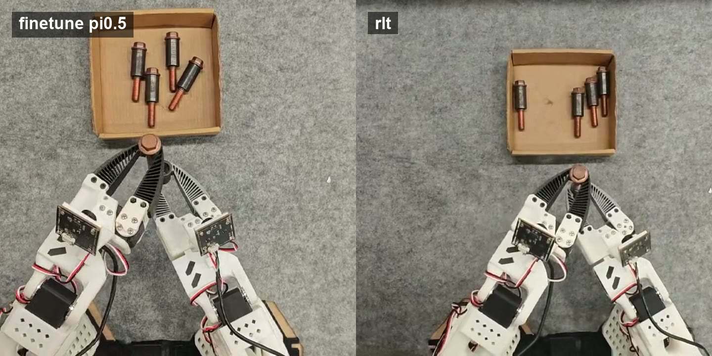

<h1 align="center">Evo-RLT</h1>

<p align="center">
  <a href="https://github.com/huggingface/lerobot"></a>
  <a href="#citation"></a>
  <a href="#model--dataset"></a>
  <a href="./LICENSE"></a>
</p>

<p align="center"><strong>SJTU-MINT</strong></p>

<p align="center">
  <strong>An independent LeRobot-based reproduction of RLT for the pi paper, covering RL-token learning, transition-cache generation, actor-critic training, and real-robot rollout.</strong>
</p>

<p align="center"><strong>Real-Robot Rollout Demo</strong></p>

<p align="center">
  <a href="./website/assets/videos/rlt_rollout.mp4">
    
  </a>
</p>

<p align="center"><a href="./website/assets/videos/rlt_rollout.mp4">Open rlt_rollout.mp4</a></p>

## Overview

Evo-RLT is a standalone reproduction repository for RLT. It keeps the algorithmic code under `evo_rlt.core` torch-only, and places LeRobot-specific integration under `evo_rlt.adapters.lerobot` so policy registration, dataset handling, recording, and deployment stay isolated from the algorithm implementation.

The project currently supports:

- VLA finetuning on LeRobot datasets.
- RL-token training on top of pi0.5 prefix hidden states.
- Transition-cache generation for chunk-level offline RL.
- Chunk actor-critic training for RLT policies.
- Real-robot recording and deployment wrappers for VLA, RLT, and human-in-the-loop collection.

## Highlights

- **Standalone RLT package:** RLT-specific code lives in `evo_rlt`, while LeRobot integration is registered at runtime.
- **Deploy-aligned artifacts:** RL-token and actor-critic policies are saved in policy-style directories that deployment scripts can consume directly.
- **Cache-first offline RL:** expensive VLA/RL-token encoding can be precomputed into transition caches before actor-critic training.
- **Robot-facing scripts:** the record wrapper supports VLA-only collection, pedal outcome labels, RLT deployment, RTC defaults, and human-in-the-loop workflows.

## Quick Start

```bash
git clone https://github.com/Shiki42/evo-rlt.git
cd evo-rlt

conda create -y -n evo-rlt python=3.10
conda activate evo-rlt

pip install -e ".[lerobot]"
```

If you are using a local LeRobot checkout instead of the package dependency, put this repository and that checkout on `PYTHONPATH`:

```bash
export PYTHONPATH=/path/to/evo-rlt/src:/path/to/lerobot/src
```

## Runtime Registration

Evo-RLT keeps policy registration out of LeRobot source files. Before using LeRobot factory helpers with RLT policy types, register the adapter once:

```python
from evo_rlt.adapters.lerobot import register

register()
```

Registered policy types:

```text
rlt_token    # RL-token reconstruction policy
rlt_ac       # chunk actor-critic policy
rlt          # deployment policy wrapper
```

## Hardware Setup

Use the [Evo-RL hardware setup](https://github.com/MINT-SJTU/Evo-RL#2-hardware-setup) for the shared robot bring-up steps: SO-series assembly, stable serial/camera paths, camera validation, PiPER/PiPER-X CAN setup, and basic teleoperation checks.

This repository only differs at the recording/deployment configuration layer:

- `evo-rlt-record` reads a setup manifest from `--setup-json`, or from `~/.roboclaw/workspace/embodied/manifest.json` when the flag is omitted.
- Arm entries point to per-device `calibration_dir` folders. The wrapper looks for `<calibration_dir>/<folder-name>.json`, then stages those files into temporary LeRobot-compatible names at runtime.
- Follower calibrations are staged as `bimanual_left.json` and `bimanual_right.json` under a temporary robot calibration directory.
- Leader calibrations are staged as `bimanual_leader_left.json` and `bimanual_leader_right.json` under a temporary teleop calibration directory.
- Dataset paths are created under `<datasets.root>/<MMDD>_<dataset-tag>/<prefix>_<HHMMSS>`. If `datasets.root` is omitted, the default is `~/.roboclaw/workspace/embodied/datasets`.

Example setup manifest:

```json
{
  "datasets": {"root": "/path/to/lerobot_datasets"},
  "arms": [
    {
      "alias": "left_follower",
      "type": "follower",
      "port": "/dev/serial/by-id/<left-follower>",
      "calibration_dir": "/path/to/calibration/<left-follower-serial>"
    },
    {
      "alias": "right_follower",
      "type": "follower",
      "port": "/dev/serial/by-id/<right-follower>",
      "calibration_dir": "/path/to/calibration/<right-follower-serial>"
    },
    {
      "alias": "left_leader",
      "type": "leader",
      "port": "/dev/serial/by-id/<left-leader>",
      "calibration_dir": "/path/to/calibration/<left-leader-serial>"
    },
    {
      "alias": "right_leader",
      "type": "leader",
      "port": "/dev/serial/by-id/<right-leader>",
      "calibration_dir": "/path/to/calibration/<right-leader-serial>"
    }
  ],
  "cameras": [
    {
      "alias": "left_wrist",
      "port": "/dev/v4l/by-path/<left-wrist>",
      "width": 640,
      "height": 480,
      "fps": 30,
      "fourcc": "MJPG"
    },
    {
      "alias": "right_wrist",
      "port": "/dev/v4l/by-path/<right-wrist>",
      "width": 640,
      "height": 480,
      "fps": 30,
      "fourcc": "MJPG"
    },
    {
      "alias": "right_front",
      "port": "/dev/v4l/by-path/<right-front>",
      "width": 640,
      "height": 480,
      "fps": 30,
      "fourcc": "MJPG"
    }
  ]
}
```

## Training Pipeline

The typical RLT workflow has four stages.

### 1. Finetune VLA

Use LeRobot's training entrypoint to finetune a pi0.5 VLA checkpoint on a LeRobot dataset.

```bash
python -m lerobot.scripts.lerobot_train \
  --dataset.repo_id=<HF_ORG>/<DATASET> \
  --dataset.root=<LOCAL_DATASET_ROOT> \
  --policy.path=<BASE_PI05_CHECKPOINT_DIR> \
  --policy.device=cuda \
  --policy.dtype=bfloat16 \
  --batch_size=16 \
  --steps=30000 \
  --save_freq=5000 \
  --eval_freq=0 \
  --output_dir=outputs/vla_ft \
  --job_name=vla_ft
```

### 2. Train RL Token

```bash
python -c 'from evo_rlt.adapters.lerobot import register; register(); from lerobot.scripts.lerobot_train import main; main()' \
  --dataset.repo_id=<HF_ORG>/<DATASET> \
  --dataset.root=<LOCAL_DATASET_ROOT> \
  --policy.type=rlt_token \
  --policy.vla_pretrained_path=outputs/vla_ft/checkpoints/last/pretrained_model \
  --policy.vla_dtype=bfloat16 \
  --policy.rl_token_num_rl_tokens=1 \
  --policy.token_pool_size=0 \
  --policy.device=cuda \
  --batch_size=8 \
  --steps=10000 \
  --save_freq=2000 \
  --eval_freq=0 \
  --output_dir=outputs/rl_token \
  --job_name=rl_token
```

### 3. Build Transition Cache

```bash
evo-rlt-build-transition-cache-v2 \
  --demo-dataset-repo-id <HF_ORG>/<DATASET> \
  --demo-dataset-root <LOCAL_DATASET_ROOT> \
  --rl-token-policy-path outputs/rl_token/checkpoints/last/pretrained_model \
  --vla-pretrained-path outputs/vla_ft/checkpoints/last/pretrained_model \
  --output-dir outputs/cache \
  --task-instruction "<TASK>" \
  --chunk-length 10 \
  --frame-stride 2 \
  --batch-size 8 \
  --num-workers 2 \
  --train-ratio 0.9 \
  --device cuda
```

### 4. Train Chunk Actor-Critic

```bash
python -c 'from evo_rlt.adapters.lerobot import register; register(); from lerobot.scripts.lerobot_train import main; main()' \
  --dataset.type=rlt_chunk_transition \
  --dataset.repo_id=outputs/cache \
  --policy.type=rlt_ac \
  --policy.vla_pretrained_path=outputs/vla_ft/checkpoints/last/pretrained_model \
  --policy.rl_token_pretrained_path=outputs/rl_token/checkpoints/last/pretrained_model \
  --policy.vla_dtype=bfloat16 \
  --policy.rl_token_num_rl_tokens=1 \
  --policy.chunk_length=10 \
  --policy.chunk_exec_steps=25 \
  --policy.phase_mode=always_rl \
  --policy.device=cuda \
  --batch_size=256 \
  --steps=50000 \
  --save_freq=5000 \
  --eval_freq=0 \
  --output_dir=outputs/ac \
  --job_name=rlt_ac
```

## Real-Robot Recording and Deployment

Set up the environment before running robot commands:

```bash
cd /path/to/evo-rlt
source ~/miniconda3/etc/profile.d/conda.sh
conda activate evo-rlt
export PYTHONPATH=/path/to/evo-rlt/src:/path/to/lerobot/src
export HF_HUB_OFFLINE=1
```

Default VLA-RLT-VLA real-robot collection:

```bash
evo-rlt-record collect \
  --setup-json /path/to/robot_manifest.json \
  --policy-path /path/to/rlt_ac_policy \
  --vla-path /path/to/pi05_vla_checkpoint_or_dir \
  --rl-token-path /path/to/rl_token_policy \
  --dataset-tag vla_rlt_vla_test \
  --rlt-toggle-key r \
  --teleop-toggle-key space \
  --episode-outcome-key e
```

The same collection entrypoint is exposed as `evo-rlt-collect-default` after reinstalling package entry points, but checkpoint and setup paths still need to be supplied by the caller.

Default collection controls:

```text
r              toggle RLT critical phase
space          toggle teleop intervention; pressing again exits teleop
e              save the episode as success after the double-tap window
e+e            save the episode as failure
left arrow     rerecord the current episode
Esc            stop data collection
```

Validated RTC defaults for this collection mode:

```text
RLT RTC execution horizon: 10
VLA RTC execution horizon: 25
RTC action queue refill threshold: 30
```

VLA-only full-process recording with pedal outcome labels:

```bash
evo-rlt-record full \
  --initial-source vla \
  --policy-path <AC_OR_VLA_POLICY_PATH> \
  --vla-path <BASE_OR_FINETUNED_VLA_PT> \
  --phase-mode always_vla \
  --chunk-exec-steps 25 \
  --pedal-outcome \
  --double-tap-window-s 0.6 \
  --num-episodes 5 \
  --episode-time-s 3000 \
  --reset-time-s 0 \
  --fps 30 \
  --vcodec h264 \
  --dataset-tag vla_full_pedal \
  --no-teleop
```

Pedal semantics in this mode:

```text
single tap    success, end current episode, start next episode
double tap    failure, end current episode, start next episode
```

## Repository Layout

```text
src/evo_rlt/core                  # algorithm core, torch-only
src/evo_rlt/adapters/lerobot      # LeRobot/pi0.5/dataset/policy/record adapters
src/evo_rlt/cli                   # training and cache CLIs
tests/rlt                         # focused RLT unit and integration tests
```

## Development Checks

```bash
PYTHONPATH=src pytest -q tests/rlt
PYTHONPATH=src python -m compileall -q src/evo_rlt tests/rlt
```

## Model & Dataset

Models and datasets will be linked here after public release. The current rollout demo is available above as `website/assets/videos/rlt_rollout.mp4`.

## Citation

Citation information will be added with the paper release.

## License

Apache-2.0. See [LICENSE](./LICENSE).
